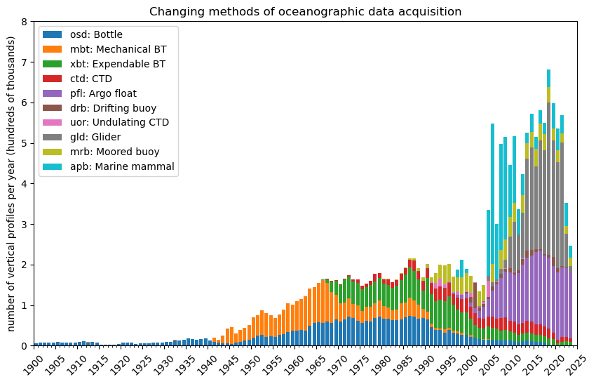

# World Ocean Data plot

The plot that has graced a thousand powerpoints

### Rationale

I couldn't find code to make this plot so I wrote these Python scripts. Feel free to use and remix them. See below for references to other existing versions of this plot.

### Usage

The script `download_wod.py` will download all the source data files from https://www.ncei.noaa.gov/data/oceans/ncei/wod to make the plot. By default it will only save the lon, lat and time columns to save space. It totals to less than 2 GB. If you choose to keep the full nc files it will take up around 180 GB of disk space. If interrupted, it will resume from the next file.

It took me several days for the download process to run. The script `retry.py` will re-run the abose script if it has crashed. Works well as a cron job. It might need some path tweaking to run on you machine. Works well on a remote server

The notebook `make-plot.ipynb` makes the plot from the downloaded files.

### Known Issues

- Various timestamp encoding issues can crash this, see above on retrying the script.
- I found that after downloading many files I started to get partial downloads. You may need to enable nc downloads to debug this
- The download takes days. Not sure if running it in parallel against the NCEI server would be appreciated though!

### Other versions

I first saw a recreation of this at a conference ~ 2022. I think it was the figure "watched waters" from this paper by Bates et. al 2018:

*Bates, A. E., Helmuth, B., Burrows, M. T., Duncan, M. I., Garrabou, J., Guy-Haim, T., et al. (2018). Biologists ignore ocean weather at their peril. Nature 560, 299–301. doi: 10.1038/d41586-018-05869-5*

I recently saw a more up to date version presented by Alexey Mishonov at IMDIS 2024 in Bergen:

*2023 release of World Ocean Database and World Ocean Atlas
Alexey Mishonov, Tim Boyer, Ricardo Locarnini, Hernan Garcia, Dan Seidov, James Reagan, Christopher Paver,
Olga Baranova, Scott Cross, Courtney Bouchard, Ebenez Nyadro, Alexandra Grodsky and Dmitry Dukhovsko
https://imdis.seadatanet.org/content/download/171431/file/IMDIS2024_programme_V4.pdf*

### References

This work uses data from NCEI Standard Product: World Ocean Database (WOD) https://www.ncei.noaa.gov/access/metadata/landing-page/bin/iso?id=gov.noaa.nodc:NCEI-WOD
